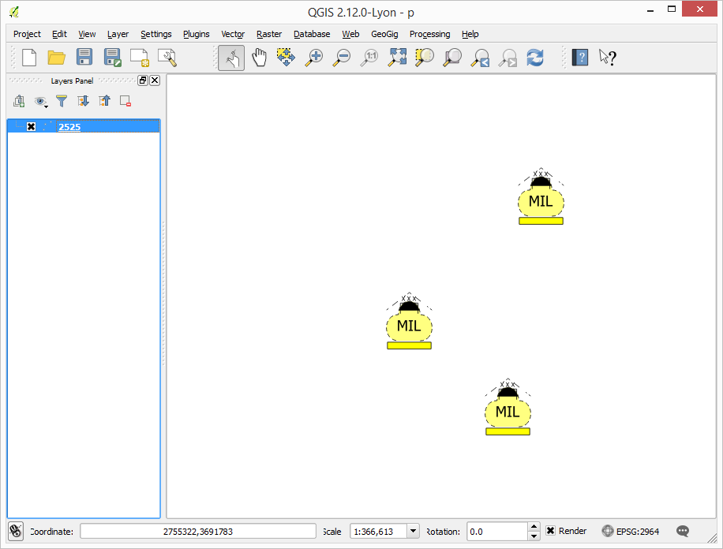
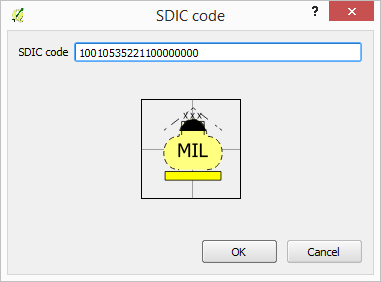

MIL-STD-2525
============

Support for MIL-STD-2525 in QGIS

This plugin adds two new capabilities to QGIS:

- Custom renderer for rendering a layer with SDIC codes in one of its attributes

- Custom editor widget, for entering SDIC codes in the corresponding field with an icon preview.

Custom Renderer
----------------

The symbology window should contain a new renderer named "MIL-STD-2525".

.. image:: img/rendererEntry.png

It has two configuration parameters: size and field

.. image:: img/symbologyDialog.png

In the field combo box, select the attribute from the layer that contains the SDIC codes to be used for setting the markers

In the size text box, enter the rendering size of the markers in pixels.

Once the renderer is active, layer features are rendered using the codes in the selected attribute.

For features with an invalid code in the selected field, a default marker with a question mark is shown.

Custom editor widget
---------------------

To set the editor widget, open the properties of the layer that contains SDIC code in one of its attributes and go to the "Fields" group.

For the attribute that contain SDIC codes (in the image above, the attribute called "SDIC"), click on the button in the "Edit widget" column. A new dialog will open. Select the "SDIC code editor" option and click OK. Close the properties window.

If you now open the attributes table of the layer and switch to the form view mode, the SDIC field will have a text box to enter the code and a button. 

Clicking on the button will show the preview dialog, that you can use to enter a code and preview the corresponding icon

Further info
=============

Here's some extra info to continue developing/testing this plugin:

A generator of markers from SDIC codes can be found here:

http://spatialillusions.com/unitgenerator.html

This tool is useful for checking that markers are correctly rendered and the SDIC codes are being correctly interpreted.

Eventually, an interface like that, in which you select the categories and the SDIC code is cumputed base on that, could beimplemented for the custom editor widget

---

Markers single parts, from which full markers are created, are taken from this project:

https://github.com/Esri/joint-military-symbology-xml

Additional info about the icons themselves and the coding of markers can be found there as well.

Current status
===============

Both renderer and custom widget are implemented, but still not working correctly.

The renderer sometimes freezes QGIS. A dialog (probably a progress one?) is shown when the canvas is refreshed, and sometimes that crashes QGIS

Also, when the MIL-STD-2525 renderer is selected and the selection switches to another different renderer, the following exception is raised:

	TypeError: invalid result type from MilStd2525RendererWidget.renderer()

For the custom widget, it can be correctly set for an attirbute, but when the attribute table is then opened, QGIS crashes and a minidump is generated.

The same problem appears with the example custom edit widget in the PyCookBook. A plugin that has a custom widget and works fine can be found here (in case it helps to compares and find out the reason of this malfunctioning)

https://github.com/elpaso/qgis-formawarevaluerelationwidget