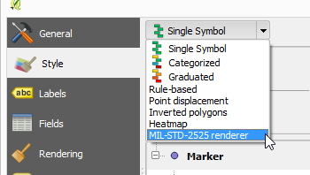
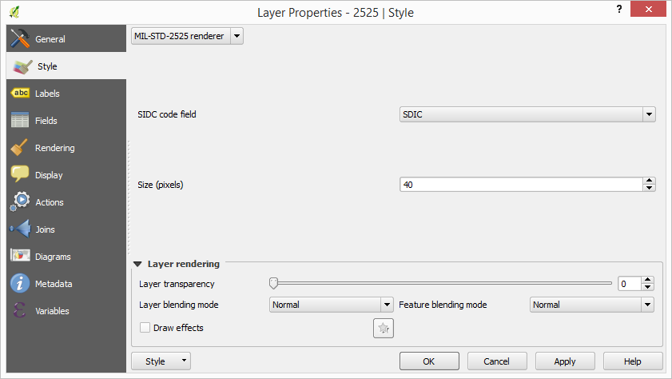
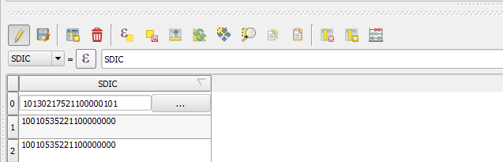

MIL-STD-2525
============

Support for MIL-STD-2525 in QGIS

This plugin adds two new capabilities to QGIS:

- Custom renderer for rendering a layer with SIDC codes in one of its attributes

- Custom editor widget, for entering SIDC codes in the corresponding field with an icon preview.

Custom Renderer
----------------

The symbology window should contain a new renderer named "MIL-STD-2525".

It has two configuration parameters: size and field

In the field combo box, select the attribute from the layer that contains the SIDC codes to be used for setting the markers

In the size text box, enter the rendering size of the markers in pixels.

Once the renderer is active, layer features are rendered using the codes in the selected attribute.

.. image:: ../img/renderedLayer.png

For features with an invalid code in the selected field, a default marker with a question mark is shown.

Custom editor widget
---------------------

To set the editor widget, open the properties of the layer that contains SIDC code in one of its attributes and go to the "Fields" group.

For the attribute that contain SIDC codes (in the image above, the attribute called "SDIC"), click on the button in the "Edit widget" column. A new dialog will open. Select the "SIDC code editor" option and click OK. Close the properties window.

If you now open the attributes table of the layer and put it in edit mode, the SIDC field will have a text box to enter the code and a button.

Clicking on the button will show the preview dialog, that you can use to enter a code and preview the corresponding icon

.. image:: ../img/markerPreview.png

Further info
=============

Here's some extra info to continue developing/testing this plugin:

A generator of markers from SIDC codes can be found here:

http://spatialillusions.com/unitgenerator.html

This tool is useful for checking that markers are correctly rendered and the SDIC codes are being correctly interpreted.

---

Markers single parts, from which full markers are created, are taken from this project:

https://github.com/Esri/joint-military-symbology-xml

Additional info about the icons themselves and the coding of markers can be found there as well.

Current status
===============

Both renderer and custom widget are implemented.

The renderer raises an exception when it is deselected in the properties windows. Work can  be resumed after closing the error dialog, and it does not charsh QGIS.

The error is related to the rendered object being garbage collected by QGIS, and is likely to be a SIP issue.

