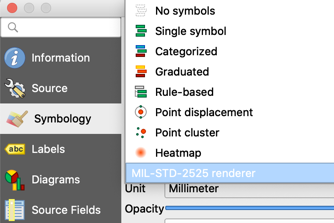
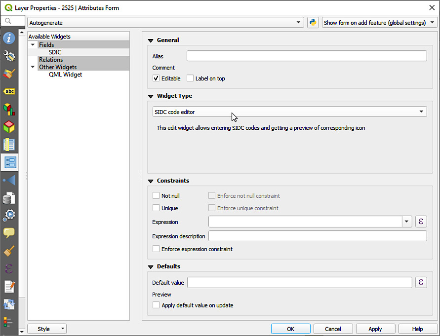

Usage
=====

The *MIL-STD-2525* plugin adds support for MIL-STD-2525 - a standard for joint military symbology - in QGIS. In MIL-STD-2525, marker symbols are composed of several levels of information (for example, *StandardIdentity1*, *Status*, *Icon*, and so on). Each level's options are represented by a unique set of one or more digits. These codes are concatenated into a unique Symbol Identification Code (SIDC) that will determine the look of the final symbol.

̣This plugin adds two new capabilities to QGIS:

* A custom renderer for styling point vector layers with SIDC codes in one of its attributes.

* Custom field edit widget for creating and entering SIDC codes, showing all levels of information and their respective options.

Custom Renderer
---------------

The custom renderer will allow styling vector point layers using SIDC codes from one of the layer's attributes.

In the :guilabel:`Symbology` tab of the :guilabel:`Layer Properties` dialog, you will find a new renderer named *MIL-STD-2525*.

The renderer has two configuration parameters:

* :guilabel:`SIDC code field`, to set the layer's attribute with the SIDCs (Symbol identification code) to build the markers for each point feature. The field must be of the type String, with at least 20 characters.
* :guilabel:`Symbol size`, to set rendering size of the markers, in pixels.

.. figure:: img/symbologyDialog.png

Once the renderer is active, the layer's point features are rendered as markers using the codes from the selected attribute.

.. figure:: img/renderedLayer.png

Features with a NULL or invalid SIDC code in the selected field, a default marker with a question mark is shown.

Custom edit widget
------------------

The custom field edit widget helps to enter SIDC codes in the feature form and attribute table, with a marker preview.

To set the edit widget to a layer's field, open the :guilabel:`Layer Properties` dialog of the layer, and go to the :guilabel:`Attributes Form` tab. In the :guilabel:`Fields` group, for the field that you want to use to store SIDC codes, click on the pop up menu in the :guilabel:`Widget type` group box, and select the :guilabel:`SIDC code editor` option from the list of widgets. Finally, close the :guilabel:`Layer Properties` dialog by clicking :guilabel:`OK`.

Now, if you open the attributes table of the layer and set the layer to edit mode, the SIDC field will have a text box to enter the code and a button.

.. figure:: img/customWidget.png

.. warning::

    On OsX/macOS it is sometimes tricky to have QGIS edit widgets work as expected. In the context of the MIL-STD2525 plugin is sometimes hard to have the widget button work immediately. The workaround is first needed to double click in the table cell as if it would be necessary to manually edit the symbology code. The table cell gets then a blue frame, after that the widget button gets a blue background and becomes clickable.

.. figure:: img/mil_mac01.png

.. figure:: img/mil_mac02.png

Clicking on the button will show the preview dialog, that you can use to enter a code and preview the corresponding marker.

.. figure:: img/markerPreview.png

Feature Editing
---------------

The following scenarios cover working with, or integrating, the plugin into
feature editing workflows within QGIS.

Existing vector layer already has an SIDC attribute field
.........................................................

To have existing SIDC values rendered as icons on map canvas:

* Assign renderer for map layer to the *MIL-STD-2525* custom renderer (see above).
* Map the field to the :guilabel:`SIDC code field` configuration option (see above).

To visually change existing SIDC attribute values:

* Ensure the vector layer has the *custom edit widget* mapped to the SIDC field (see above).
* Toggle the vector map layer into edit mode.
* Using the :guilabel:`Identify Features` map tool, select features. In the resulting :guilabel:`Identify Results` panel, click the :guilabel:`View feature form` button, then use the edit widget mapped to the SIDC field to change the code.
* Alternatively, you can chose to :guilabel:`Open Attribute Table` for the vector map layer, where you can see and edit all feature attributes. Switch it to 'form view', then use the edit widget mapped to the SIDC field to change the code for single or multiple features.

Existing vector layer does NOT have an SIDC attribute field
...........................................................

Add a new attribute field to the original data source of the vector layer. The properties of the field vary per data source type, though it only needs to be large enough to store the SIDC code text.

For example, to add an SIDC text field to an ESRI shapefile, set its properties as follows (suggested field name)::

  Field   Type     Length   Precision
  SIDC    String   25       0

Then, you can visually add a new symbol attribute value by following the workflow preceeding this one.

Add new features to an existing vector layer and set SIDC attribute value
.........................................................................

Assuming all preceeding workflows have been addressed for the vector map layer, i.e. an SIDC attribute field exists and the custom renderer and edit widget have been mapped:

* Toggle the vector map layer into edit mode
* Use QGIS feature creation tools (see official docs) to create a new feature.
* An attribute form should pop up, where you can use the edit widget mapped to the SIDC field to visually add a new code.

.. note::

   If the attribute form does not show up upon feature creation, ensure the :guilabel:`Options -> Digitizing -> Feature creation -> 'Suppress attribute form pop-up after feature creation'` option is not checked. If you want to keep that option checked, you will have to use other means to edit the attribute vaule, e.g. :guilabel:`Identify Features` map tool or :guilabel:`Open Attribute Table` action, as noted above.
