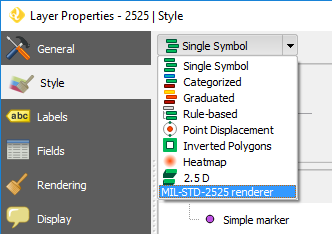
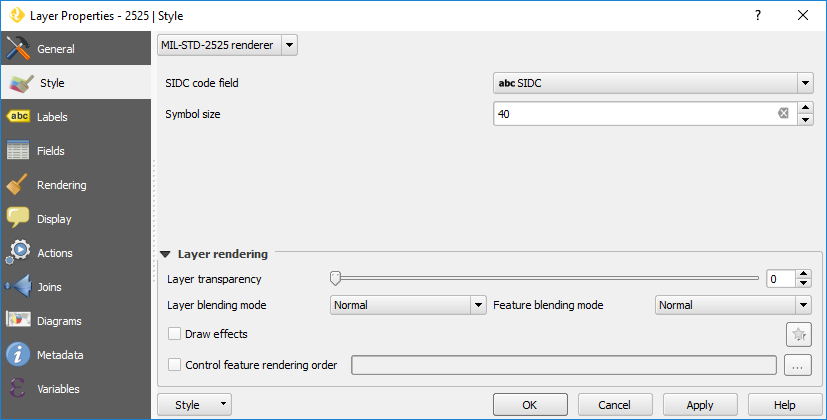
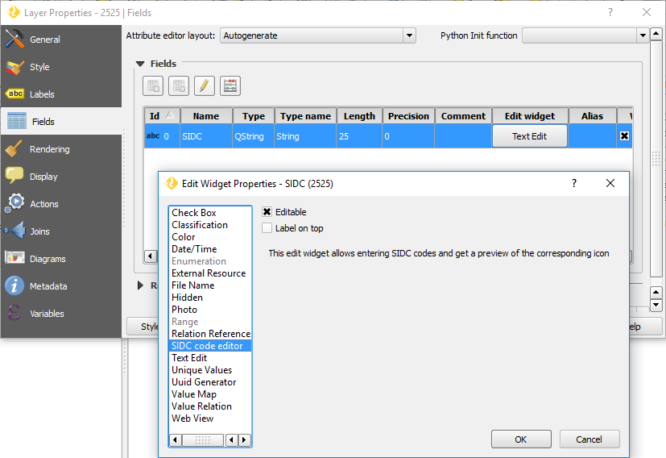
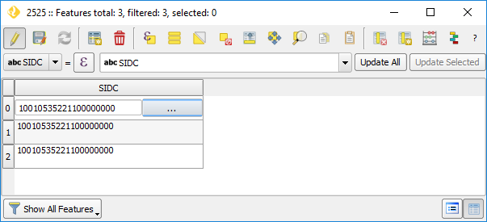
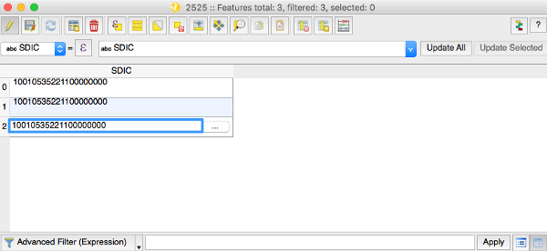
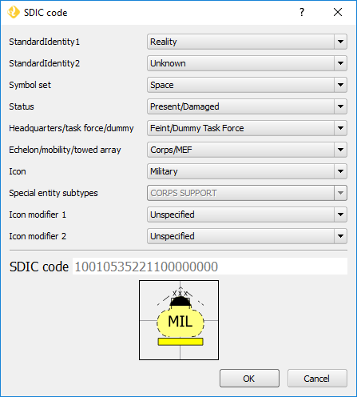

Usage
=====

The *MIL-STD-2525* plugin adds support for MIL-STD-2525 - a standard for joint military symbology - in QGIS. In MIL-STD-2525, marker symbols are composed of several levels of information (for example, *StandardIdentity1*, *Status*, *Icon*, and so on). Each level's options are represented by a unique set of one or more digits. These codes are concatenated into a unique Symbol Identification Code (SIDC) that will determine the look of the final symbol.

̣This plugin adds two new capabilities to QGIS:

* A custom renderer for styling point vector layers with SIDC codes in one of its attributes.

* Custom field edit widget for creating and entering SIDC codes, showing all levels of information and their respective options.

Custom Renderer
---------------

The custom renderer will allow styling vector point layers using SIDC codes from one of the layer's attributes.

In the :guilabel:`Style` tab of the :guilabel:`Layer Properties` dialog, you will find a new renderer named *MIL-STD-2525*.

The renderer has two configuration parameters:

* :guilabel:`SIDC code field`, to set the layer's attribute with the SIDCs (Symbol identification code) to build the markers for each point feature. The field must be of the type String, with at least 20 characters.
* :guilabel:`Symbol size`, to set rendering size of the markers, in pixels.

Once the renderer is active, the layer's point features are rendered as markers using the codes from the selected attribute.

.. figure:: img/renderedLayer.png

Features with a NULL or invalid SIDC code in the selected field, a default marker with a question mark is shown.

Custom edit widget
------------------

The custom field edit widget helps to enter SIDC codes in the feature form and attribute table, with a marker preview.

To set the edit widget to a layer's field, open the :guilabel:`Layer Properties` dialog of the layer, and go to the :guilabel:`Fields` tab. In the :guilabel:`Fields` group, for the field that you want to use to store SIDC codes, click on the button in the :guilabel:`Edit widget` column. The :guilabel:`Edit Widget Properties` dialog will open. Select the :guilabel:`SIDC code editor` option from the list of widgets and click :guilabel:`OK`. Finally, close the :guilabel:`Layer Properties` dialog by clicking :guilabel:`OK`.

Now, if you open the attributes table of the layer and set the layer to edit mode, the SIDC field will have a text box to enter the code and a button.

.. warning::

    On OsX/macOS it is sometimes tricky to have QGIS edit widgets work as expected. In the context of the MIL-STD2525 plugin is sometimes hard to have the widget button work immediately. The workaround is first needed to double click in the table cell as if it would be necessary to manually edit the symbology code. The table cell gets then a blue frame, after that the widget button gets a blue background and becomes clickable.

.. figure:: img/mil_mac02.png

Clicking on the button will show the preview dialog, that you can use to enter a code and preview the corresponding marker.

